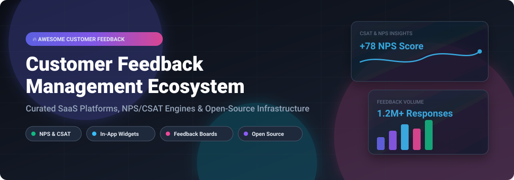

# 🚀 Awesome Customer Feedback Management

[](https://github.com/ishandutta2007/Awesome-Customer-Feedback-Management)

<div align="center">

<a href="https://github.com/ishandutta2007/Awesome-Awesome-Awesome"></a><a href="https://discord.gg/jc4xtF58Ve"></a>
<a href="https://github.com/ishandutta2007/Awesome-Customer-Feedback-Management/stargazers"></a>
<a href="https://github.com/ishandutta2007/Awesome-Customer-Feedback-Management/network/members"></a>
<a href="https://github.com/ishandutta2007/Awesome-Customer-Feedback-Management/blob/main/LICENSE"></a>
<a href="https://github.com/ishandutta2007"></a>

</div>

---

## 📌 Overview & Ecosystem Scope

A curated index of top **Customer Feedback Management (CFM)**, **Experience Management (XM)**, **Net Promoter Score (NPS)**, **Customer Satisfaction (CSAT)**, **Feature Request Voting Boards**, and **Open-Source Survey Infrastructure**.

Modern SaaS product teams and Customer Experience (CX) leaders rely on customer feedback loops to capture Voice of Customer (VoC), analyze sentiment, triage product feature requests, and prioritize product roadmaps.

---

## 📚 Table of Contents

- [📊 Market Overview & Industry Dynamics](#-market-overview--industry-dynamics)
- [🏢 SaaS & Hosted Customer Feedback Platforms](#-saas--hosted-customer-feedback-platforms)
- [🔓 Open-Source GitHub Projects](#-open-source-github-projects)
- [💡 Architecture Patterns & Integration Flow](#-architecture-patterns--integration-flow)
- [🤝 How to Contribute](#-how-to-contribute)
- [☕ Support & Sponsorship](#-support--sponsorship)
- [⚠️ Disclaimer](#%EF%B8%8F-disclaimer)
- [📈 Star History](#-star-history)

---

## 📊 Market Overview & Industry Dynamics

> 💡 **Market Size & Fragmentation Insight:**  
> The global Customer Feedback Management (CFM) & Experience Management market is estimated at **$10.5 Billion in 2026** and projected to reach **$21.8 Billion by 2032** (CAGR ~12.5%). The market is **moderately fragmented**: enterprise heavyweights (Qualtrics, SurveyMonkey) dominate traditional corporate research, while fast-growing Product-Led Growth (PLG) feedback platforms (Productboard, Canny) and self-hosted open-source disruptors (Formbricks, PostHog) capture modern developer and SaaS product teams.

---

## 🏢 SaaS & Hosted Customer Feedback Platforms

The table below summarizes leading commercial platforms, sorted by **Company Size (Valuation / Revenue)** in descending order.

| Platform | Key Capabilities & Use Cases | Starting Price | Free Tier / Trial Limits | Company Size (Valuation / ARR) |
| :--- | :--- | :--- | :--- | :--- |
| **[Qualtrics](https://www.qualtrics.com/)** | Enterprise Experience Management (XM), CoreXM, advanced survey logic, AI sentiment & journey analytics. | $125/month ($1,500/year billed annually) | 30-day free trial (up to 100 responses & 1 active survey) | **~$12.5B Valuation** (~$1.5B ARR) |
| **[Productboard](https://www.productboard.com/)** | Product feedback consolidation, feature request triage, customer portal, and strategic roadmap alignment. | $20/user/month (Essentials plan) | 14-day free trial (unlimited feedback capture & roadmap features) | **~$1.72B Valuation** (~$50M ARR) |
| **[SurveyMonkey](https://www.surveymonkey.com/)** | Mass market survey creation, market research panels, template library, and automated analytics. | $25/month (Individual Advantage) | Free Basic Plan (10 questions per survey & 40 responses/survey) | **~$1.5B Valuation** (~$480M ARR) |
| **[Alchemer](https://www.alchemer.com/)** | Formerly SurveyGizmo. Flexible enterprise workflow integration, custom survey logic, and CSAT engine. | $55/user/month (Collaborator plan) | 7-day free trial (up to 100 survey responses included) | **~$450M Valuation** (~$60M ARR) |
| **[Canny](https://canny.io/)** | Customer feedback boards, feature voting, product changelog, and automated status updates for users. | $79/month (Starter plan) | Free Plan forever (up to 100 active tracked users & 1 feedback board) | **~$100M Valuation** (~$10M ARR) |
| **[UserVoice](https://www.uservoice.com/)** | Enterprise B2B product feedback collection, smart feedback grouping, and revenue-weighted prioritization. | $699/month (Pro plan) | 14-day free trial (full enterprise feedback module access) | **~$80M Valuation** (~$20M ARR) |
| **[QuestionPro](https://www.questionpro.com/)** | Multi-channel CX survey engine, NPS/CSAT tracking, employee experience, and mobile research panels. | $99/user/month (Advanced plan) | Free Essentials Plan (unlimited surveys & up to 200 responses/survey) | **~$75M Valuation** (~$25M ARR) |
| **[Survicate](https://survicate.com/)** | Targeted in-app, website, web app, and email surveys for continuous micro-feedback collection. | $99/month (Business plan) | Free Plan forever (up to 25 responses/month & 1 active survey) | **~$40M Valuation** (~$8M ARR) |
| **[Zonka Feedback](https://www.zonkafeedback.com/)** | Multi-channel feedback app (in-app, kiosk, SMS, email), offline surveys, and real-time CX alerts. | $49/month (Starter plan) | 7-day free trial (up to 100 survey responses included) | **~$20M Valuation** (~$44M ARR) |
| **[NPS.today](https://nps.today/)** | Focused Net Promoter Score (NPS) measurement platform integrated with CRM and ERP workflows. | €49/month (~$54/month) | 14-day free trial (up to 50 NPS invitations included) | **~$10M Valuation** (~$2M ARR) |

---

## 🔓 Open-Source GitHub Projects

Self-hosted and developer-first feedback tools offer full data privacy control, custom deployment flexibility, and cost efficiency. Sorted by **GitHub Stars_Count** descending.

- **[PostHog](https://github.com/PostHog/posthog)** [](https://github.com/PostHog/posthog/stargazers)  
  *Open-source product analytics suite with built-in user feedback widgets, in-app micro-surveys, session replay, and feature flags.*

- **[Typebot](https://github.com/baptisteArno/typebot.io)** [](https://github.com/baptisteArno/typebot.io/stargazers)  
  *Visual conversational form builder enabling interactive, chat-style customer feedback and lead collection embedded anywhere.*

- **[Formbricks](https://github.com/formbricks/formbricks)** [](https://github.com/formbricks/formbricks/stargazers)  
  *Leading open-source Experience Management (XM) platform—in-app micro-surveys, link surveys, user segmentation, and self-hosted privacy focus (Qualtrics alternative).*

- **[LimeSurvey](https://github.com/LimeSurvey/LimeSurvey)** [](https://github.com/LimeSurvey/LimeSurvey/stargazers)  
  *Battle-tested open-source online survey system designed for complex academic, market, and customer research questionnaires.*

- **[Talkyard](https://github.com/debiki/talkyard)** [](https://github.com/debiki/talkyard/stargazers)  
  *Open-source feedback board, community discussion forum, and Q&A engine for product suggestions.*

- **[Fider](https://github.com/getfider/fider)** [](https://github.com/getfider/fider/stargazers)  
  *Simple, lightweight open-source customer feedback platform for gathering ideas and letting community vote on feature requests.*

- **[OhMyForm](https://github.com/ohmyform/ohmyform)** [](https://github.com/ohmyform/ohmyform/stargazers)  
  *Open-source Typeform alternative for building web forms, surveys, and collecting customer feedback responses.*

- **[Feedback Fish](https://github.com/feedback-fish/feedback-fish)** [](https://github.com/feedback-fish/feedback-fish/stargazers)  
  *Lightweight open-source React component for collecting quick in-app user feedback with screenshots.*

---

## 💡 Architecture Patterns & Integration Flow

For self-hosted privacy-first feedback architectures:

```
[ In-App Widget / Survey ] ──> [ Formbricks / PostHog ] ──> [ Postgres Data Warehouse ]
                                                                      │
[ Customer Feedback Board ] ──> [ Fider / Talkyard ] ─────────────────┴──> [ Metabase / Open BI ]
```

1. **Collect**: Trigger targeted in-app NPS/CSAT surveys using **Formbricks** or **PostHog**.
2. **Prioritize**: Allow public feature request voting on **Fider** or **Canny**.
3. **Analyze**: Store structured responses in a warehouse and query with BI tools for product roadmap alignment.

---

## 🤝 How to Contribute

Contributions are highly welcomed! Please check out the [Awesome List Guidelines](https://github.com/ishandutta2007/Awesome-Awesome-Awesome).

1. **Fork** this repository.
2. Add your tool under the appropriate section (SaaS table or Open-Source list).
3. Ensure factual information regarding starting pricing, free tier limits, or GitHub star links.
4. Submit a **Pull Request** with a brief summary of the project.

---

## ☕ Support & Sponsorship

If you find this repository helpful for your product team, engineering stack, or market research:

- ⭐ **Star** this repository to increase visibility.
- 🔀 **Fork** it to build your internal feedback tool guide.
- 📢 **Share** it with fellow Product Managers, CX Leaders, and Developers.

💖 **Sponsor & Buy Me a Coffee:**  
Support further maintenance and open-source curation via the [GitHub Sponsor Dashboard](https://github.com/sponsors/ishandutta2007).

---

## ⚠️ Disclaimer

- This repository is a community-curated list and does not constitute official financial or vendor endorsement.
- Customer feedback platforms handle user PII (Personally Identifiable Information). Always ensure compliance with GDPR, CCPA, and regional privacy regulations when collecting feedback.

---

## 📈 Star History

[](https://star-history.dera.page/#ishandutta2007/Awesome-Customer-Feedback-Management&type=date&legend=top-left)

---

**Made with ❤️ for product managers, customer experience teams, and open-source enthusiasts.**
